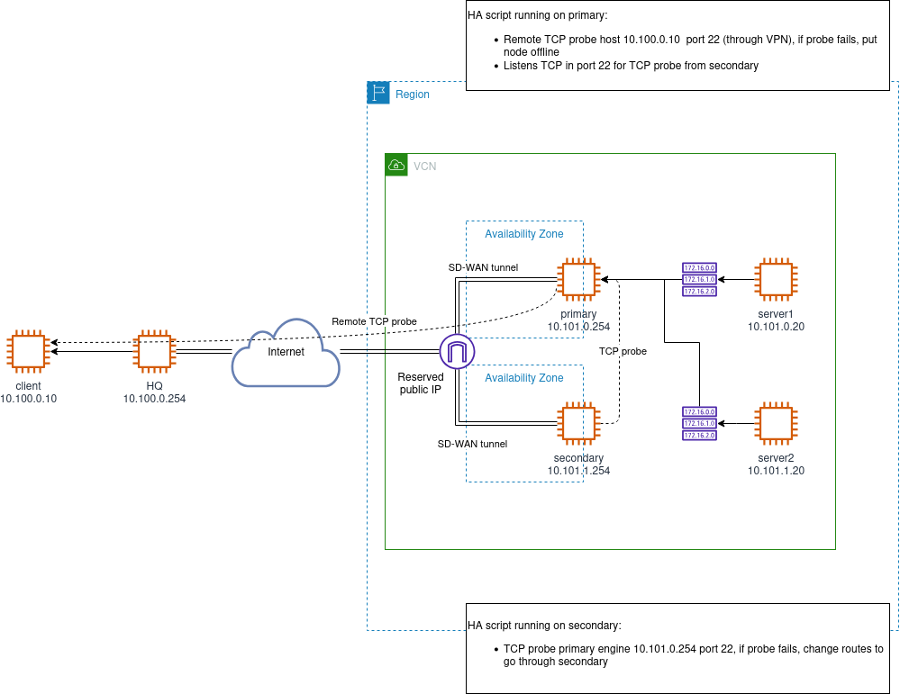

# OCI HA Script

High-availability failover extension script for **Forcepoint Secure SD-WAN**
(formerly Next Generation Firewall) engine pairs deployed in Oracle Cloud
Infrastructure (OCI). The script runs on a primary/secondary pair of SD-WAN
Engines and automatically reroutes traffic through the healthy engine when it
detects a failure by updating OCI route tables and, optionally, reassigning a
public IP address.

## How It Works

- The **primary** engine monitors a remote host via TCP probing. If probing
  fails, it marks itself offline via an OCI instance freeform tag.
- The **secondary** engine monitors the primary via TCP probing. If the primary
  is unreachable or marked offline, the secondary takes over by updating OCI
  route tables (and optionally moving the public IP).

## Key Features

- Automatic failover via OCI route table updates
- Optional public IP reassignment to the active engine
- Compatibility with policy and route based VPN
- TCP health probing (primary-to-remote and secondary-to-primary)
- OCI Instance Principal authentication
- Configurable via SMC Custom Properties, OCI instance freeform tags, or both
- Debug and dry-run modes for safe testing

## Prerequisites

- Two Forcepoint Secure SD-WAN Engines deployed in OCI
- OCI Instance Principal with permissions assigned to each instance
- One or more OCI route tables directing internal traffic through the
  firewall pair

See the [User Guide](./doc/user_guide.md) for full setup and permission details.

## Configuration

The script reads configuration from two sources that are merged at runtime:

1. **SMC Custom Properties** - set in the Engine properties within the SMC
2. **OCI instance freeform tags** - prefixed with `FP_HA_` (e.g.
   `FP_HA_route_table_id`)

When the same key appears in both sources, OCI instance freeform tags take
precedence. Refer to the [User Guide](./doc/user_guide.md) for the full list
of mandatory and optional properties.

## Development

Building from source is only recommended if you want to modify the behaviour.
Use prebuilt GitHub releases otherwise.

- **Python 3.11** (via pyenv or similar)
- Build the self-expanding zipapp installer: `make all`

See [doc/development.md](./doc/development.md) for details.

## License

Licensed under the Apache License 2.0 - see [LICENSE](./LICENSE).
