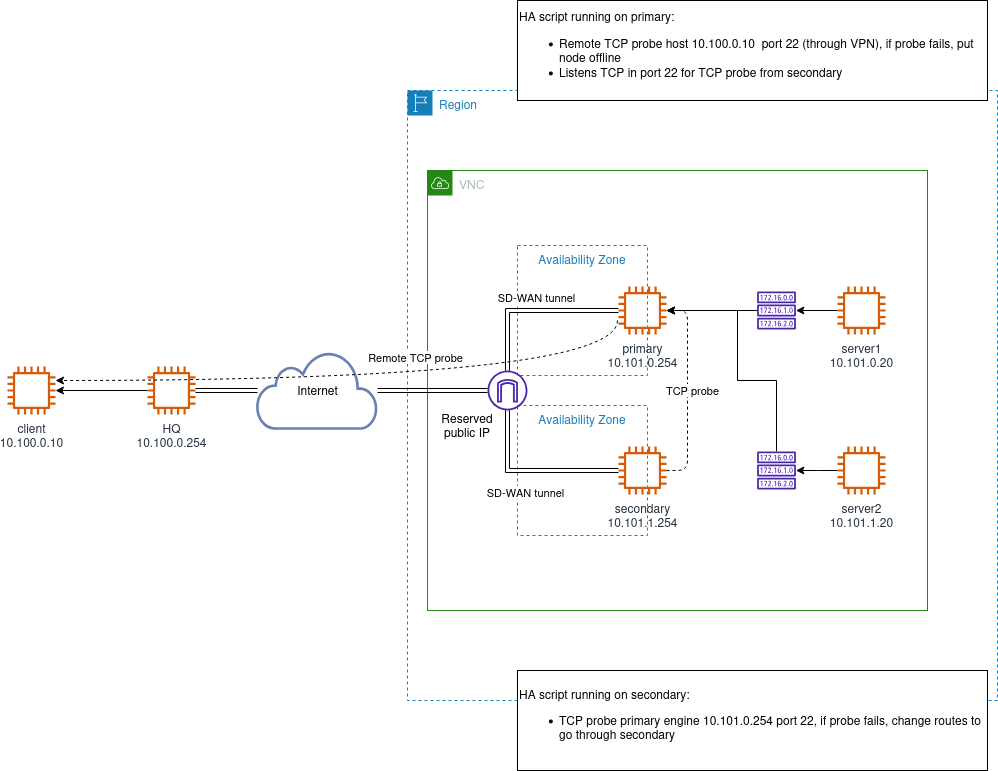

## Introduction

The script is used by a pair of Single FlexEdge Secure SD-WAN Engines
(formerly Next Generation Firewall) on Oracle Cloud Infrastructure (OCI) to act
as primary and secondary pair. One of the SD-WAN Engines acts as
the **primary** and always processes the traffic under normal circumstances.
The second Engine acts as the **secondary** and constantly monitors the primary:

- It checks the state of the OCI route table from the internal network to
  the pair of firewalls.
- It periodically tries to open a TCP connection on a well-known port (SSH
  by default) on the VNIC referenced by the route table.
- It checks the operational status of the primary (online/offline), which
  the primary stores in an OCI instance freeform tag value.

When the secondary detects an abnormal situation regarding one of these
criteria, it takes action to become active and receive the traffic:

- It modifies the OCI route table from the internal network(s) to point to
  the secondary
- Optionally, it moves a reserved public IP address to the secondary

## Operation

The diagram below shows how the HA script operates:

- On the primary NGFW instance, the script monitors a remote host (TCP
  remote probing). If such probing fails, the primary gives control to the
  secondary by going offline and storing its offline state to OCI instance
  freeform tag.
- On the secondary NGFW instance, the script monitors the primary instance
  (TCP probing). If such probing fails, the secondary takes over by
  re-routing traffic to itself and optionally moving the public IP.



## The Script Configuration

This script requires a set of configuration properties, which can be set in
two different ways:

- Specify settings as a **Custom Properties Profile** in the Engine properties
  in the SMC. They will appear in the file <b>{se_script_path}_allow</b> on the
  Engine.
- Specify properties as **OCI instance freeform tags** of the compute instance.
  The tags must have prefix **FP_HA_**, e.g. FP_HA_route_table_id.

The script will merge the two sources of configuration. This allows
specifying attributes where it's convenient for the administrator.

**Note** In case the same key is defined in both sources, the OCI tags source
takes precedence.

### Mandatory Properties

The following configuration properties are mandatory:

| Property              | Example                              | Default | Description                                                                                                              |
|-----------------------|--------------------------------------|---------|--------------------------------------------------------------------------------------------------------------------------|
| route_table_id        | ocid1.routetable.oc1.iad.aaaa...     |         | Route table OCID that sends the traffic from subnet(s) to the SD-WAN Engine. Can be comma-separated for multiple tables. |
| internal_nic_idx      | 0                                    | 0       | Internal NIC (VNIC) index that receives the traffic from the route table.                                                |
| primary_instance_id   | ocid1.instance.oc1.iad.aaaa...       |         | Primary instance OCID (OCI identifier). **Note** Must be declared on both primary and secondary.                         |
| secondary_instance_id | ocid1.instance.oc1.iad.aaaa...       |         | Secondary instance OCID (OCI identifier). **Note** Must be declared on both primary and secondary.                       |
| se_script_path        | /data/config/hooks/policy-applied/99_oci_ha_script_installer.py |         | Path on the engine where the installation script is going to be delivered. **Note** Must be a property declared via SMC. |

### Optional properties

The following configuration properties are optional.

#### Moveable public IP

| Property                  | Example                       | Default     | Description                                                                             |
|---------------------------|-------------------------------|-------------|-----------------------------------------------------------------------------------------|
| reserved_public_ip_id     | ocid1.publicip.oc1.iad.aaaa...|             | Reserved public IP OCID to move during failover. Requires matching wan_nic_idx.         |
| wan_nic_idx               | 1                             | 1           | WAN NIC (VNIC) index that receives public traffic. Required with reserved_public_ip_id. |

#### Probing from Secondary to Primary

| Property          | Example                 | Default | Description                                                                                                                                                                           |
|-------------------|-------------------------|---------|---------------------------------------------------------------------------------------------------------------------------------------------------------------------------------------|
| probe_enabled     | true                    | true    | Specifies whether TCP probing mechanism is enabled. Possible values are "true" or "false".                                                                                            |
| probe_ip [1]      | 10.101.0.254,10.0.0.254 |         | A comma-separated list of private IP addresses of the Primary Engine used for probing.                                                                                                |
| probe_port        | 2222                    | 22      | The TCP port used by the Secondary to probe the Primary. **Note** TCP connections to this port must be allowed in the security rules.                                                 |
| probe_timeout_sec | 2                       | 2       | Timeout in seconds after an attempt by the Secondary to connect to the Primary is declared as failed.                                                                                 |
| probe_max_fail    | 10                      | 10      | The number of consecutive failed attempts by the Secondary to connect to the Primary before starting the switchover procedure (the time will be probe_max_fail * check_interval_sec). |

[1] Comma-separated list of private IP addresses of the Primary SD-WAN
Engine used for probing. If unspecified, all IP addresses of the Primary
VNICs will be used. If none of these addresses respond to the probe, the
Secondary will take over by changing the OCI route table to the local
protected network. The assumption is that if the Primary could not respond
to probe, it is dead (network failure between the Primary and the Secondary
is not considered).

#### Probing from Primary to the Remote Host

| Property             | Example                 | Default | Description                                                                                                                                                                          |
|----------------------|-------------------------|---------|--------------------------------------------------------------------------------------------------------------------------------------------------------------------------------------|
| remote_probe_enabled | true                    | false   | Specifies whether TCP probing mechanism from the Primary to the Remote host(s) is enabled (e.g. to make sure SD-WAN is working properly). Possible values are "true" or "false".     |
| remote_probe_ip [2]  | 10.100.0.10,10.101.0.10 |         | A comma-separated list of private IP addresses of remote host(s).                                                                                                                    |
| remote_probe_port    | 8080                    | 80      | Remote port to probe.                                                                                                                                                                |
| probe_timeout_sec    | 2                       | 2       | Timeout in seconds after an attempt by the Primary to connect Remote hosts is declared as failed.                                                                                    |
| probe_max_fail       | 10                      | 10      | The number of consecutive failed attempts by the Primary to connect to Remote hosts before starting the switchover procedure (the time will be probe_max_fail * check_interval_sec). |

[2] A comma-separated list of Remote hosts (accessible via the SD-WAN)
private IP addresses that the Primary Engine probes periodically to make
sure the SD-WAN tunnel is still up. If none of these addresses responds to
the probe, the Primary will hand off to the Secondary by putting itself
offline. This property is mandatory if **remote_probe_enabled** is set to
**true**.

#### Other Properties

| Property           | Example | Default | Description                                                                                                                                                   |
|--------------------|---------|---------|---------------------------------------------------------------------------------------------------------------------------------------------------------------|
| log_facility       | -1      | -1      | The facility used by this script to send events to the SMC. Type 'sg-logger -s' to get the list of facilities. **Note** If not set, defaults to USER_DEFINED. |
| check_interval_sec | 1       | 1       | A periodic interval in seconds for both Primary and Secondary to check the status.                                                                            |

## OCI-Specific Configuration

Oracle HA script assumes some cloud infrastructure to exist.  This section
explains what are the cloud dependencies for deploying the script.

### OCI IAM Instance Principal

The OCI HA script makes various OCI REST API calls. The script uses
**Instance Principal** authentication, which allows instances to authenticate
to OCI services without requiring credentials to be stored on the instance.

#### Required IAM Policy

The compute instances must have permissions to perform the following actions:

```
Allow dynamic-group <ha-instances-group> to manage virtual-network-family in compartment <compartment-name>
Allow dynamic-group <ha-instances-group> to manage instance-family in compartment <compartment-name>
Allow dynamic-group <ha-instances-group> to manage public-ips in compartment <compartment-name>
```

#### Dynamic Group

Create a dynamic group that includes both primary and secondary instances:

```
Any {instance.id = '<primary-instance-ocid>', instance.id = '<secondary-instance-ocid>'}
```

Or use compartment-based matching:

```
Any {instance.compartment.id = '<compartment-ocid>'}
```

### Network Configuration

#### Virtual Network Interface Cards (VNICs)

All NGFW instances need to have at least one VNICs attached to them.  Each VNIC
is identified by their NIC index, which corresponds to the order in which they
appear in the OCI instance metadata:

| NIC Index | Config Property    | Default | Role                          |
|-----------|--------------------|---------|-------------------------------|
| 0         | `internal_nic_idx` | 0       | Internal (protected) traffic  |
| 1         | `wan_nic_idx`      | 1       | WAN / public-facing traffic   |

- **Internal VNIC** (`internal_nic_idx`): Receives traffic from the
  protected subnet route tables. During failover the HA script updates the
  route table to point to the **private IP OCID** of this VNIC on the newly
  active instance.
- **WAN VNIC** (`wan_nic_idx`): Faces the public internet. When a
  `reserved_public_ip_id` is configured, the HA script reassigns the
  reserved public IP to the **private IP OCID** of this VNIC on the newly
  active instance.

Both the primary and secondary instances must use the same NIC index
layout. Ensure that:

1. Each instance has VNICs attached at the configured NIC indices.
2. Each VNIC has a primary private IP assigned.
3. VNIC attachments are in the **ATTACHED** lifecycle state.
4. The internal VNIC's subnet is associated with the route table(s)
   specified in `route_table_id`.

If `probe_ip` is not explicitly set, the secondary discovers the primary's
probe addresses by enumerating all VNICs attached to the primary instance
and collecting their private IP addresses.

#### Route Tables

Configure the protected subnet route tables to initially route traffic through
the primary instance's internal private IP:

- Destination: 0.0.0.0/0 (or specific CIDR)
- Target Type: Private IP
- Target: Primary instance internal VNIC private IP OCID

The HA script will update this to point to the secondary when failover occurs.

#### Reserved public IP

If configuring Oracle HA for policy based VPN, a reserved public IP is needed
to maintain a single IPsec contact address for the replicated nodes.

- **Ephemeral**: Auto-assigned, released when instance stops
- **Reserved**: Can be moved between instances, maintained independently

The HA script can only manage Reserved public IPs, moving them between primary
and secondary instances during failover.  This reserved public IP is configured
through `reserved_public_ip_id`.

#### Security Rules

Ensure security lists or network security groups allow:

1. **Probing traffic**: TCP from secondary to primary on probe_port (default 22)
2. **Remote probing** (optional): TCP from primary to remote hosts on
                                  remote_probe_port
3. **HA traffic**: Traffic routed through the instances

## How to Create Configuration in SMC

The sections below show how to create the configuration in SMC.

### Create the Custom Properties Profile Element

The first step is to create the Custom Properties Profile element that will
be used for both Engines:

1. Login to SMC with the Management Client
2. Navigate to **Configuration** > **Engine** > **Other Elements** >
   **Engine Properties** > **Custom Properties Profiles**
3. Click the **New** button > **Custom Properties Profile**
4. Configure the Custom Properties Profile with attributes to have the
   Secondary Engine monitor the Primary Engine, to have the Primary Engine
   monitor the Remote host (optional) and click OK. Here is an example
   configuration (see *The Script Configuration* section for parameter
   descriptions):

**Note** If you prefer, you can create a separate Custom Properties Profile for
each Engine.

Example configuration properties:

```
route_table_id: ocid1.routetable.oc1.iad.aaaaaaaa...
internal_nic_idx: 0
wan_nic_idx: 1
primary_instance_id: ocid1.instance.oc1.iad.aaaaaaaa...
secondary_instance_id: ocid1.instance.oc1.iad.bbbbbbbb...
reserved_public_ip_id: ocid1.publicip.oc1.iad.cccccccc...
probe_enabled: true
probe_port: 22
se_script_path: /data/config/hooks/policy-applied/99_oci_ha_script_installer.py
```

### Select the Custom Properties Profile in Each Engine Properties

Now that the Custom Properties Profile element has been created, it needs to
be added to the Engine properties:

1. In the Management Client, navigate to **Configuration** > **Engine** >
   **Engines**
2. Right-click the Secondary Engine element and open it for editing
3. Navigate to **Advanced Settings** > **Custom Properties Profiles**
4. Click the **Add** button > select the custom properties profile you
   created for the Secondary Engine > **Select**
5. Click the **Save** button to save the changes
6. Add the Custom Properties Profile for the Primary Engine similarly and save
   the Engine

### Add Access Rules to Allow Probing Connections and Install the Policy

The Engine Access Rules will not allow probing connections by default, so
rules need to be added to allow them. Let's first add rules to the Primary
Engine:

1. In the Management Client, right-click the Primary Engine >
   **Current Policy** > **Edit**
2. Find a suitable location for the rules and right-click the **ID** field of
   the rule below > **Add Rule Before**
3. Configure the rule to allow probing traffic from Secondary Engine to the
   Primary
4. (Optional) If you wish to have the Primary monitor the Remote host status,
   add another rule that allows these connections
5. Click the **Save and Install** button to install the configuration to the
   Primary Engine

A rule needs to be added also to the Secondary Engine policy:

1. In the Management Client, right-click the Secondary Engine > **Current
   Policy** > **Edit**
2. Find a suitable location for the rules and right-click the **ID** field of
   the rule below > **Add Rule Before**
3. Configure the rule to allow probing traffic from Secondary Engine to the
   Primary
4. Click the **Save and Install** button to install the configuration to the
   Secondary Engine

## Create the OCI Instance Freeform Tag Configuration

If you wish to use OCI instance freeform tags to define custom properties, the
configuration is created in the Oracle Cloud Infrastructure Console:

1. Navigate to **Compute** > **Instances**
2. Click on the instance name
3. Under **Resources**, click **Tags**
4. Click **Add Tags**
5. Select **Tag Namespace**: (None) for freeform tags
6. Enter **Tag Key**: FP_HA_<property_name> (e.g., FP_HA_route_table_id)
7. Enter **Tag Value**: The property value
8. Click **Add Tags**

Repeat for each property you want to configure via tags.

For more information, see the [Tagging Overview](https://docs.oracle.com/en-us/iaas/Content/Tagging/Concepts/taggingoverview.htm)
in the Oracle Cloud Infrastructure documentation.

## Configuration Examples

### Example Configuration

Basic configuration that only updates route tables:

**Primary Instance Tags:**
```
FP_HA_route_table_id: ocid1.routetable.oc1.iad.aaaaaa...
FP_HA_primary_instance_id: ocid1.instance.oc1.iad.primary...
FP_HA_secondary_instance_id: ocid1.instance.oc1.iad.secondary...
FP_HA_internal_nic_idx: 0
FP_HA_probe_enabled: true
FP_HA_probe_port: 22
```

**Secondary Instance Tags:**
```
FP_HA_route_table_id: ocid1.routetable.oc1.iad.aaaaaa...
FP_HA_primary_instance_id: ocid1.instance.oc1.iad.primary...
FP_HA_secondary_instance_id: ocid1.instance.oc1.iad.secondary...
FP_HA_internal_nic_idx: 0
FP_HA_probe_enabled: true
FP_HA_probe_port: 22
```

### Example Configuration with a moveable IP

Configuration that updates routes AND moves public IP:

**Primary Instance Tags:**
```
FP_HA_route_table_id: ocid1.routetable.oc1.iad.aaaaaa...
FP_HA_primary_instance_id: ocid1.instance.oc1.iad.primary...
FP_HA_secondary_instance_id: ocid1.instance.oc1.iad.secondary...
FP_HA_internal_nic_idx: 0
FP_HA_wan_nic_idx: 1
FP_HA_reserved_public_ip_id: ocid1.publicip.oc1.iad.reserved...
FP_HA_probe_enabled: true
FP_HA_probe_port: 22
```

**Secondary Instance Tags:**
```
FP_HA_route_table_id: ocid1.routetable.oc1.iad.aaaaaa...
FP_HA_primary_instance_id: ocid1.instance.oc1.iad.primary...
FP_HA_secondary_instance_id: ocid1.instance.oc1.iad.secondary...
FP_HA_internal_nic_idx: 0
FP_HA_wan_nic_idx: 1
FP_HA_reserved_public_ip_id: ocid1.publicip.oc1.iad.reserved...
FP_HA_probe_enabled: true
FP_HA_probe_port: 22
```

### Example with Remote Host Monitoring

Configuration with remote host monitoring enabled:

```
FP_HA_route_table_id: ocid1.routetable.oc1.iad.aaaaaa...
FP_HA_primary_instance_id: ocid1.instance.oc1.iad.primary...
FP_HA_secondary_instance_id: ocid1.instance.oc1.iad.secondary...
FP_HA_internal_nic_idx: 0
FP_HA_probe_enabled: true
FP_HA_probe_port: 22
FP_HA_remote_probe_enabled: true
FP_HA_remote_probe_ip: 10.100.0.10,10.101.0.10
FP_HA_remote_probe_port: 80
```

## Make Changes and Recover from the Failover

The sections below show how an administrator can update, disable or
uninstall the script, how to manage the script from the Engine command line,
and how to recover from the failover.

### Update the Script or Change the Configuration

In order to upload a new version of the script or change the configuration
in the SMC:

1. Login to SMC with the Management Client
2. Navigate to **Configuration** > **Engine** > **Engines**
3. Open the Engine element for editing
4. Navigate to **Advanced Settings** > **Custom Properties Profiles**
5. Right-click the custom properties profile element > **Properties**
6. (Optional) Update the script file by clicking **Browse** >
   locate the new script file and select it > **Open**
7. (Optional) Make changes to the attribute configuration as desired
8. Click **OK** to save the changes
9. Click the **Save and Refresh** button to install the updated
   configuration to the Engine

If you are using OCI instance tags, update the script and settings in the
existing tag element settings, and refresh the Engine policy via SMC.

**Note** You must refresh the policy via SMC even if you only changed OCI
instance tags in OCI configuration.

### Disable the Script

To disable the script:

1. Login to SMC with the Management Client
2. Navigate to **Configuration** > **Engine** > **Engines**
3. Open the Engine element for editing
4. Navigate to **Advanced Settings** > **Custom Properties Profiles**
5. Right-click the custom properties profile element > **Properties**
6. Add a custom property **disabled:true** and click **OK** to save the changes
7. Click the **Save and Refresh** button to refresh the Engine configuration

If using OCI instance tags, add an OCI tag **FP_HA_disabled:true** to the
tag configuration, and install the Engine configuration via SMC.

### Uninstall the Script

In order to completely uninstall the script do the following:

1. Login to SMC with the Management Client
2. Navigate to **Configuration** > **Engine** > **Engines**
3. Open the Engine element for editing
4. Navigate to **Advanced Settings** > **Custom Properties Profiles**
5. Right-click the custom properties profile element > **Properties**
6. Add a custom property **uninstall:true** and click **OK** to save the changes
7. Click the **Save and Refresh** button to refresh the Engine configuration

At this point `/data/run-at-boot` and `/data/run-at-boot_allow` files do not
exist any more. After this, open the custom properties profile element for
editing in SMC and click the **Clear** button next to the script, save the
element and refresh the Engine configuration. This will remove the script
from the `/data/config/hooks/policy-applied` directory.

### Manage the Script from the Engine Command Line

The script can be managed also from the Engine command line via a SSH
connection with these commands:

| Operation          | Command             |
|--------------------|---------------------|
| Start the script   | `msvc -u user_hook` |
| Stop the script    | `msvc -d user_hook` |
| Restart the script | `msvc -r user_hook` |

**Note** Stopping the script from the command line does not prevent the
script to be restarted at next reboot. You need to apply the *Uninstall the
Script* procedure described above.

### Recover from the Failover

If the OCI HA script performs a route failover, the Primary Engine goes
offline and the traffic is routed through the Secondary Engine. If defined,
a reserved public IP is also moved to the Secondary Engine.

Once the issue that caused the failover has been resolved, the system must be
put to HA ready state manually to recover back to the situation where the
Primary Engine is handling traffic. Perform the following steps:

1. Put the Primary Engine online to have the script update OCI route tables
   to point to the Primary Engine again (and move the public IP back if defined)
2. Make sure that VPNs work with both Engines
3. Make sure that remote probe hosts are accessible through VPNs
4. Make sure that the Primary Engine probe from the Secondary Engine is
   accessible

## Troubleshooting

Below you will find instructions how to troubleshoot issues with the HA
script operation.

### Script Installation

The script installation traces are written to the
`/data/diagnostics/cloud-ha-install.log` file. View this file content when
experiencing issues with the script installation. The file can be viewed by
connecting to the Engine using SSH or by collecting sginfo from the Engine,
extracting the sginfo tarball and checking the `cloud-ha-install.log` file.

### Verify the Script Is Running

To check that the script is running on the Engine, connect to the Engine via
SSH and run the command below:

`pgrep -af run-at-boot`

You should see output similar to this when the script is running:

`19418 /usr/bin/python3.11 /data/run-at-boot`

### Script Logs

The script writes logs to the `/data/diagnostics/cloud-ha-<date>.log` file(s).
To view these logs, check them via a SSH connection or by collecting sginfo,
extracting the sginfo archive and checking the log file.

### Check Script Logs in SMC

The script logs are sent also to SMC. These messages can be viewed in the
SMC logs view by filtering logs with **Facility: User Defined** filter and
checking the Information Message field from the entries:

1. Login to SMC with the Management Client
2. Click the **Logs** button
3. On the **Query** pane **Filter** tab, add a new filter for the Facility
   field and select the **User Defined** value
4. Click **Apply** to filter the logs
5. Check the **Information Message** field for script operation messages

### Enable the Debug Mode

To get debug level logs for the script operation, the debug mode can be
enabled in the custom property profile settings. This is done by adding a
custom property **debug:true** to the custom properties profile, and installing
the policy.

**Note** The debug mode should be disabled after the troubleshooting has been
done to avoid generating unnecessary debug level messages.

### Enable the Dry-Run Mode

Dry-run mode does not modify the system. Node state is not changed, route
tables are not updated, and public IPs are not moved. To enable dry-run mode
add a custom property **dry_run:true** to the custom properties profile and
install the policy.

**Note** The dry-run mode should be disabled after the troubleshooting has been
done to let the script perform changes to the system.

### OCI-Specific Troubleshooting

#### Instance Principal Authentication Issues

If the script fails to authenticate to OCI APIs:

1. Verify the dynamic group includes both instances
2. Check IAM policies grant required permissions
3. Verify the instances are running in the correct compartment
4. Check `/data/diagnostics/cloud-ha-<date>.log` for authentication errors

#### Reserved Public IP Issues

If the public IP is not moving during failover:

1. Verify `reserved_public_ip_id` is correctly configured
2. Check the reserved public IP is not assigned to any ephemeral allocation
3. Verify IAM policies allow `manage public-ips` permission
4. Check logs for 409 conflict errors (may indicate ephemeral IP conflict)

#### Route Table Update Issues

If routes are not updating during failover:

1. Verify `route_table_id` contains valid OCIDs
2. Check the route table contains routes targeting private IP OCIDs
3. Verify IAM policies allow `manage virtual-network-family` permission
4. Ensure routes target private IP OCIDs, not VNIC OCIDs directly

#### VNIC and Private IP Issues

If the script cannot find VNICs or private IPs:

1. Verify `internal_nic_idx` and `wan_nic_idx` are correct
2. Check VNICs are attached to the instances
3. Verify private IPs are assigned to the VNICs
4. Check VNIC attachment lifecycle state is "ATTACHED"

## Differences from AWS HA Script

If you are familiar with the AWS HA script, key differences include:

1. **Authentication**: Uses OCI Instance Principal instead of IAM roles
2. **Network Resources**: VNICs and Private IPs instead of ENIs
3. **Identifiers**: OCIDs instead of AWS resource IDs (i-xxx, rtb-xxx)
4. **Moveable public IP**: Support for moveable public IPs
5. **API**: Direct REST API calls instead of boto3 library
6. **Tags**: Freeform tags instead of EC2 tags

## Additional Resources

- [OCI Compute Documentation](https://docs.oracle.com/en-us/iaas/Content/Compute/home.htm)
- [OCI Networking Documentation](https://docs.oracle.com/en-us/iaas/Content/Network/Concepts/overview.htm)
- [OCI Instance Principal Authentication](https://docs.oracle.com/en-us/iaas/Content/Identity/Tasks/callingservicesfrominstances.htm)
- [OCI Tagging](https://docs.oracle.com/en-us/iaas/Content/Tagging/Concepts/taggingoverview.htm)
